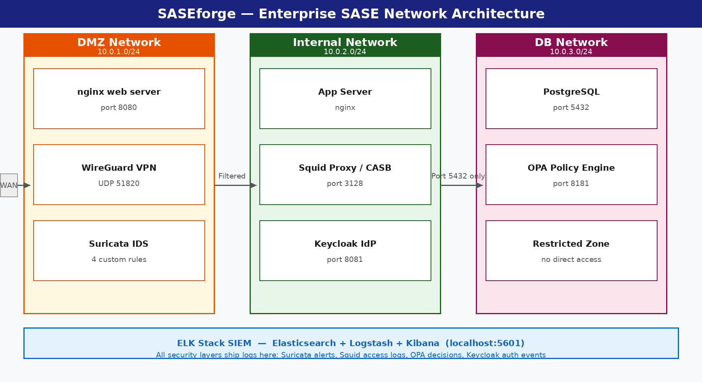
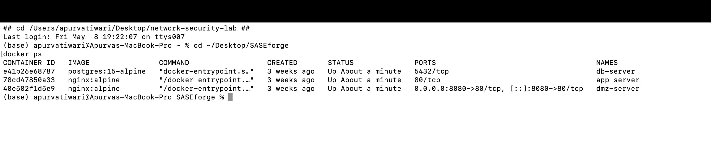
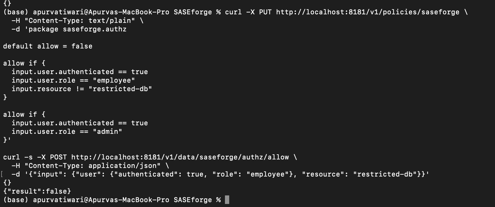

# SASEforge

A hands-on implementation of a **Secure Access Service Edge (SASE)** security platform built from scratch using open-source tools. This project simulates a real enterprise network with multiple security layers including firewall, VPN, proxy, CASB, ZTNA, and SIEM — all running on Docker and VirtualBox.

> MS Computer Networks semester project | Built for learning, portfolio, and real-world relevance.

---

## Architecture Overview



Three isolated Docker bridge networks simulate enterprise segmentation:

| Network | Subnet | Purpose |
|---|---|---|
| `dmz-network` | 10.0.1.0/24 | Public-facing nginx server, exposed on port 8080 |
| `internal-network` | 10.0.2.0/24 | Internal application server, no direct external access |
| `db-network` | 10.0.3.0/24 | PostgreSQL database, restricted to internal access only |

Traffic flows inward through the perimeter layer (WireGuard, pfSense, Suricata), through the proxy/CASB layer (Squid), through the identity layer (Keycloak, OPA), and reaches internal resources. Every layer ships its logs to the ELK stack.

---

## Components

| Layer | Tool | Purpose |
|---|---|---|
| Firewall | pfSense | Perimeter policy enforcement, network segmentation |
| VPN | WireGuard | Encrypted remote access tunneling |
| IDS/IPS | Suricata | Intrusion detection with custom rules |
| Proxy | Squid + mitmproxy | SSL inspection, content filtering |
| CASB | Custom proxy rules | Cloud app traffic control (block/allow) |
| Identity | Keycloak | OAuth2, MFA, SSO |
| ZTNA | Open Policy Agent | Per-request, attribute-based access control |
| SIEM | ELK Stack | Log aggregation, dashboards, alerting |

---

## Project Structure

```
SASEforge/
├── README.md
├── architecture/
│   └── network-diagram.png
├── phase1-network/
│   └── docker-compose.yml
├── phase2-perimeter/
│   ├── wireguard/
│   └── suricata/
├── phase3-proxy-casb/
│   └── squid/
├── phase4-identity/
│   ├── keycloak/
│   └── opa-policies/
├── phase5-siem/
│   └── elk/
├── scripts/
│   ├── attack_simulation.py
│   ├── check_siem_ingestion.py
│   └── validate_opa_policy.py
└── docs/
    ├── threat-model.md
    └── screenshots/
```

---

## Build Roadmap

- [x] Phase 0 - GitHub repo setup
- [x] Phase 1 - Network foundation (Docker + VLANs)
- [x] Phase 2 - Perimeter security (pfSense + WireGuard + Suricata)
- [x] Phase 3 - Proxy and CASB (Squid + SSL inspection)
- [x] Phase 4 - Identity and ZTNA (Keycloak + OPA)
- [x] Phase 5 - SIEM and attack simulation (ELK + Kibana)
- [ ] Phase 6 - Documentation and demo video

---

## Tech Stack

**Tools:** pfSense, WireGuard, Suricata, Squid, mitmproxy, Keycloak, Open Policy Agent, Elasticsearch, Logstash, Kibana

**Platform:** macOS, Docker, VirtualBox

---

## Threat Model

Threats are mapped to the [MITRE ATT&CK](https://attack.mitre.org/) framework. See [`docs/threat-model.md`](docs/threat-model.md) for full details.

Key attack scenarios simulated:

- Port scanning and reconnaissance (T1046)
- Brute force login attempts (T1110)
- Unauthorized cloud app access (T1567)
- Lateral movement across VLANs (T1021)

---

## Evidence

### Network segmentation
Three isolated networks confirmed running via `docker ps`:



### Zero-trust policy enforcement
OPA correctly denies an authenticated employee access to the restricted database:

```bash
curl -s -X POST http://localhost:8181/v1/data/saseforge/authz/allow \
  -H "Content-Type: application/json" \
  -d '{"input": {"user": {"authenticated": true, "role": "employee"}, "resource": "restricted-db"}}'
# {"result":false}
```



### Detection layer
*(in progress — attack simulation → Suricata alert → Kibana dashboard, see `scripts/attack_simulation.py`)*

---

## Getting Started

### Prerequisites

- macOS with Docker Desktop installed
- VirtualBox installed
- Git

### Clone the repo

```bash
git clone https://github.com/cybergirlApurva/SASEforge.git
cd SASEforge
```

Each phase folder contains its own setup instructions. Start with `phase1-network/`.

---

## Why SASE?

SASE (Secure Access Service Edge) combines network and security functions into a unified cloud-delivered model, replacing the old perimeter-based approach as more traffic moves to cloud and remote work. This project demonstrates hands-on implementation of every major SASE component in a working lab environment.

---

## Author

**Apurva** | MS Computer Networks
[GitHub](https://github.com/cybergirlApurva)

---

## License

MIT License — feel free to use this as a reference for your own learning.
